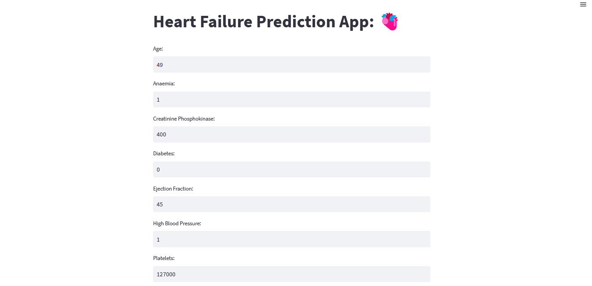
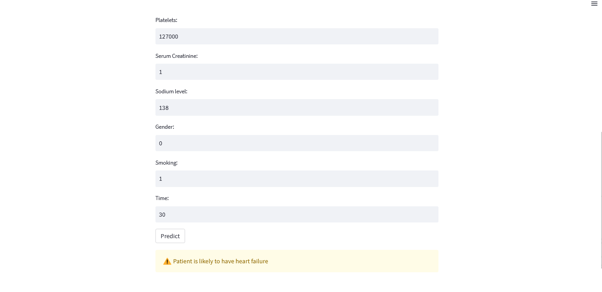
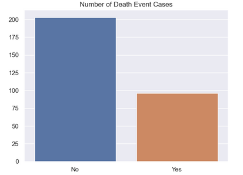
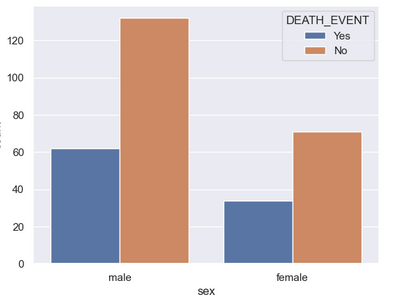
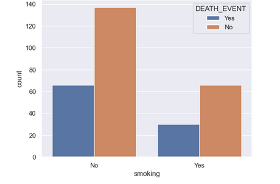
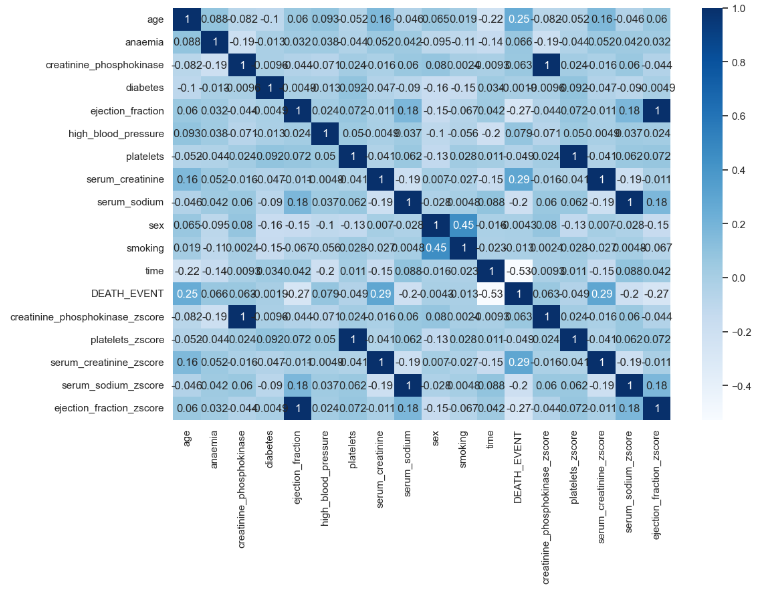

# Heart Failure Prediction Web App:

> [Web Application](https://tayyab885-heart-failure-prediction-app-76pr2m.streamlit.app/)

## Project Overview
- Create a [WebApp](https://tayyab885-heart-failure-prediction-app-76pr2m.streamlit.app/) that can predict heart failure based on some features.
- Get the Data from Kaggle. [Download](https://www.kaggle.com/datasets/andrewmvd/heart-failure-clinical-data)
- Did exploratory data analysis to get more understanding of data and perform feature engineering.
- Implement three different alogorithms(Random Forest, Logistic Regression, XgBoost).
- Create a Pipline of model that give us best results.
### Website Preview
#### App Page:



----

## Packages
- Python
- Pandas
- Numpy
- Matplotlib
- Seaborn
- Scikit-learn
- Xgboost
- Pickle
- Streamlit

## Installation: 📦
>pip install -r requirements.txt

#### Clone:

- Clone this repo to your local machine.

#### Run app locally:
Open terminal in the directory where app is cloned and run the following command in terminal.
```shell
$ streamlit run app.py
```

## EDA
I looked at the distributions of the data and the value counts for the various categorical variables. Below are a few highlights.
<br>
<br>
<br>


## Models
Classification models were tried to check for the best model to predict chronic kidney disease since the prediction of disease.
  - Random Forest Tree
  - Logistic Regression
  - Xgboost Classifier
 
## Accuracy
- Random Forest gives the accuracy of 85.7%.
- Logistic Regressiong gives the accuracy of 85%.
- Xgboost Classifier gives the accuracy of 87.5%.
    
    
    
  ---
